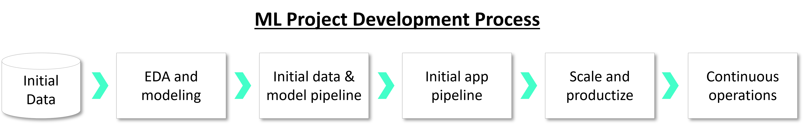

# MLOps Tutorial - NYC Taxi fare

This project demonstrates a complete ML project and the development flow from initial exploration to continuous deployment at scale.
The example is based on a [Kaggle competition](https://www.kaggle.com/competitions/new-york-city-taxi-fare-prediction). Its goal is to predict the correct trip fare, using the public NYC Taxi dataset. 

This example is intended to explain and demonstrate the overall MLOps flow by using the [MLRun](https://www.mlrun.org/) MLOps orchestration framework. It is not designed to dive into the individual components or models.

It is recommended to fork this repo into your GitHub account and clone it into your development environment.

- [**Overview**](#overview)
- [**Installation**](#installation) ([local](#local), [GitHub Codespaces](#codespaces), [Sagemaker](#sagemaker))

## Overview 

The ML application development and productization flow consists of the following steps (demonstrated through notebooks):

- [**Exploratory data analysis (EDA) and modeling**](./00-exploratory-data-analysis.ipynb).
- [**Data and model pipeline development**](./01-dataprep-train-test.ipynb) (data preparation, training, evaluation, and so on).
- [**Application & serving pipeline development**](./02-serving-pipeline.ipynb) (intercept requests, process data, inference, and so on).
- [**Scaling and automation**](./03-automation-monitoring.ipynb) (run at scale, hyper-parameter tuning, monitoring, pipeline automation, and so on).
- Continuous operations (automated tests, CI/CD integration, upgrades, retraining, live ops, and so on).

 

You can find the python source code under [/src](./src) and the tests under [/tests](./tests).

## Installation

This project can run in different development environments:
-  [Local computer](#local) (using PyCharm, VSCode, Jupyter, etc.)
-  [Inside GitHub Codespaces](#codespaces) 
-  [Sagemaker Studio and Studio Labs](#sagemaker) (free edition) or other managed Jupyter environments 

The project works with the MLRun service. Y ou can deploy the MLRun service (API, DB, UI, and execution environment) over Docker or, preferabley, over Kubernetes.
The `make mlrun-docker` launches a local MLRun service using Docker compose (the MLRun UI can be viewed in: http://localhost:8060). Alternatively edit the `mlrun.env` file to 
configure a remote MLRun service (over Kubernetes).

For resource-constrained environments without Docker you can start the MLRun service as a process (no UI) with the `make mlrun-api` command.

### Install in a local environment

First, install the package dependencies and the environment.

**Using pip (install the requirements):**

    make install-requirements
    
Your environment should include `MLRUN_ENV_FILE=<absolute path to the ./mlrun.env file> ` (point to the mlrun `.env` file in this repo). See the [mlrun client setup](https://docs.mlrun.org/en/latest/install/remote.html) instructions for details.  

**Using conda (create the `mlrun` conda env and install packages and env vars in it):**

    make conda-env
    conda activate mlrun

> **Make sure all your tasks and Notebooks use the `mlrun` python environment!**

Next, start or connect to the MLRun service:

Start a local Docker MLRun service by running `make mlrun-docker` or edit the DBPATH and credentials in the `mlrun.env` file to use a remote MLRun service.  

### Install and run inside GitHub Codespaces

This project is configured to run "as is" inside GitHub Codespaces (see the config files under `/.devcontainer`).
After the codespaces environment starts, you need to start a local MLRun service or connect to a remote one.

- For a minimal, local MLRun (no UI), run: `make mlrun-api`
- For a local Docker installation (requires 8 CPUs configuration or larger), run: `make mlrun-docker`. To view MLRun UI open the `ports` tab and browse to `MLRun UI`.
- For a remote MLRun service, edit the DBPATH and credentials in the `mlrun.env` file.  

> The local MLRun service must be started every time the codespaces environment is restarted.
  

### Install and run in Sagemaker Studio and Studio Labs

First, load this project into Sagemaker by clicking  
or through Sagemaker UI.

After the project is loaded, open a console terminal and enter the project directory (using `cd` command) and type:

    make conda-env

For a minimal setup, run MLRun service as a local process (no UI):

    conda activate mlrun && make mlrun-api

To use a remote MLRun service, edit the DBPATH and credentials in the `mlrun.env` file.

> **Make sure all your tasks and Notebooks use the `mlrun` python environment !**
